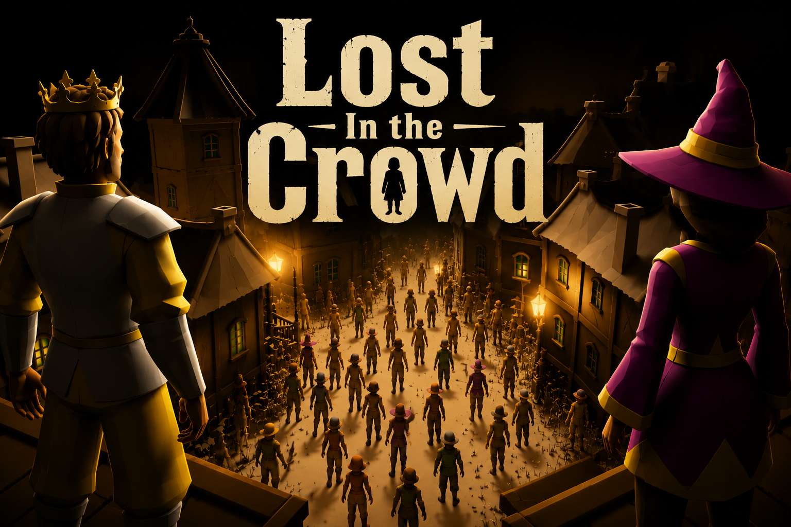
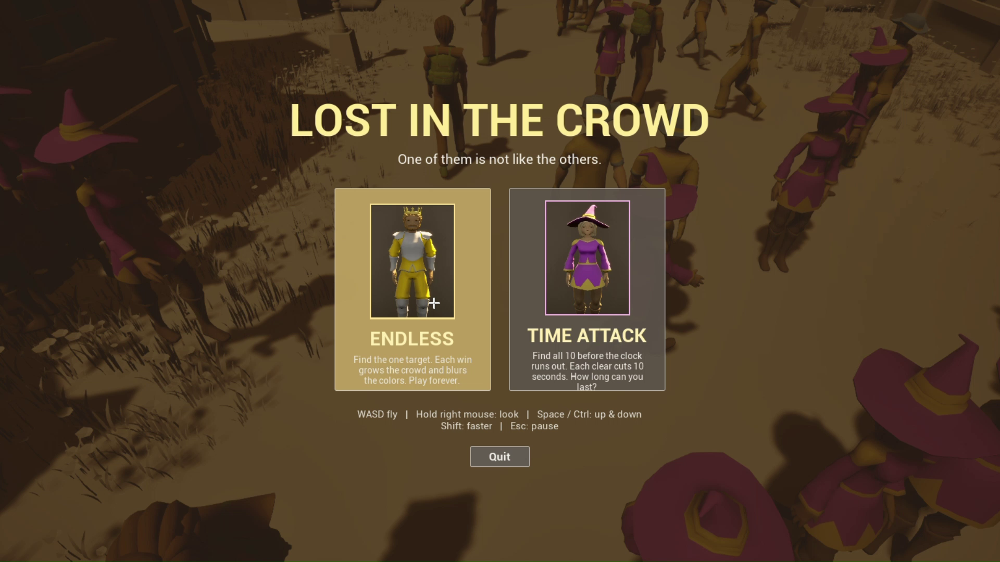
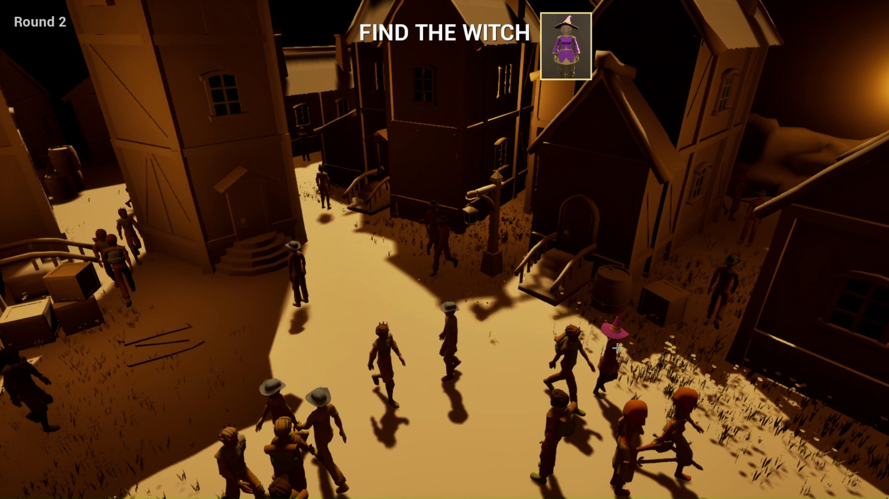
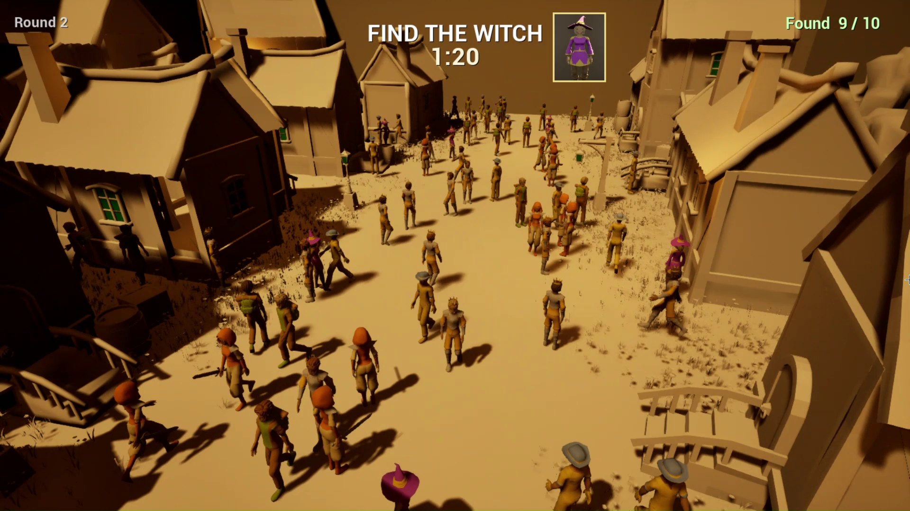
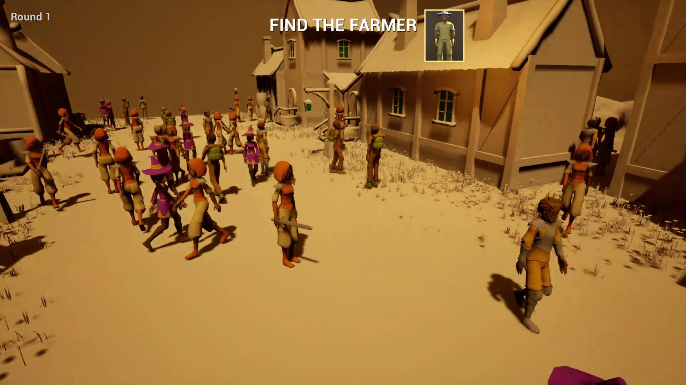
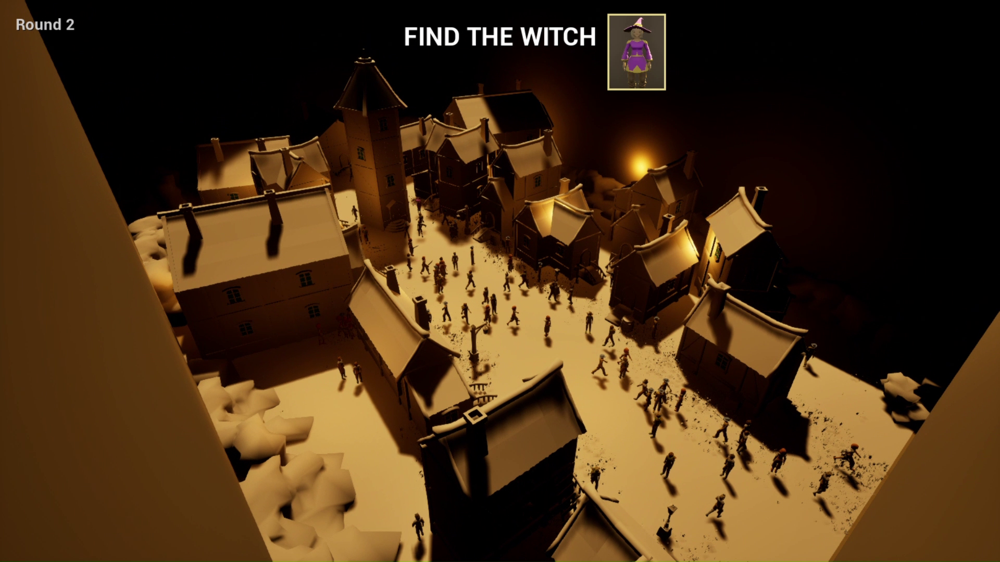
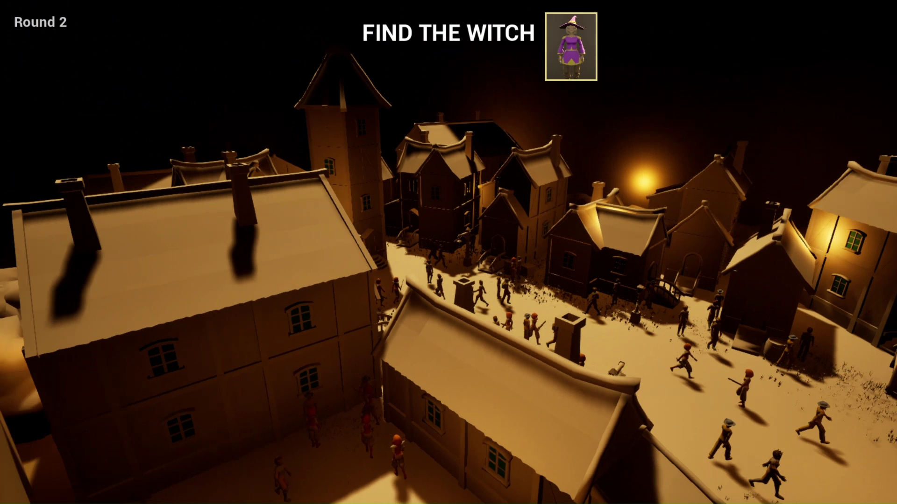

<p align="center">
  
</p>

<h1 align="center">Lost in the Crowd</h1>

<p align="center">
  <em>One of them is not like the others. Find them.</em>
</p>

<p align="center">
  <a href="https://christophrr.itch.io/lostinthecrowd"></a>
  
  
  
</p>

---

## What it is

**Lost in the Crowd** is a 3D hidden-character search game. You're shown a single target — a King, a Witch, a Farmer — then dropped above a medieval town swarming with a hundred near-identical townsfolk. Fly the camera through the streets, scan the crowd, and click the one that matches before the others blend together (or the clock runs out).

It's a *Where's Waldo* built as a living diorama: everyone walks, mills, and clusters around the same lantern-lit town, so the target is never standing still and never quite where you expect.

> **The whole game is written in C++** — gameplay, crowd AI, the UMG menus, the HUD, the difficulty curve, even the character portraits are generated in-engine. No Blueprints driving the logic.

### ▶ [Download and play on itch.io »](https://christophrr.itch.io/lostinthecrowd)

---

## Screenshots

<p align="center">
  
  <br><em>Pick your mode — Endless or Time Attack.</em>
</p>

<table>
  <tr>
    <td width="50%"></td>
    <td width="50%"></td>
  </tr>
  <tr>
    <td align="center"><em>Down in the crowd, hunting the witch.</em></td>
    <td align="center"><em>Time Attack — 9 of 10 found, clock ticking.</em></td>
  </tr>
  <tr>
    <td width="50%"></td>
    <td width="50%"></td>
  </tr>
  <tr>
    <td align="center"><em>Round 1 — a smaller, easier crowd.</em></td>
    <td align="center"><em>The full lantern-lit town from above.</em></td>
  </tr>
</table>

<p align="center">
  
  <br><em>Dusk lighting over the rooftops.</em>
</p>

---

## Game modes

| Mode | Goal | Twist |
|------|------|-------|
| **Endless** | Find the one target hidden in the crowd. | Every win **grows the crowd** and **blurs the colors** closer together — it gets harder forever. Score is how long you last and how few wrong guesses you make. |
| **Time Attack** | Find **all 10** copies of the target type in a crowd of 100 before a 2-minute clock. | Each clear **cuts the timer by 10 seconds** (floor 30s). Miss any when time runs out and the survivors flash **red through the walls** so you can see how close you were. |

**Controls**

```
WASD ............ fly the camera
Hold Right Mouse  look around
Space / Ctrl .... rise / descend
Shift ........... move faster
Left Click ...... make your guess
Esc ............. pause
```

---

## Under the hood

A short tour of the engineering, since the whole thing is C++.

**Crowd of 100, on an integrated GPU.** The renderer is deliberately lightweight — Lumen, virtual shadow maps and ray tracing are off, with FXAA — so the town holds ~40–50 FPS at 100 simultaneously-navigating NPCs at 720p on an Intel Iris Xe iGPU.

**Emergent crowd movement.** Each `ANPCAIController` runs a timer-based wander: pick a random reachable navmesh point, walk, idle, repeat. Tight medieval alleys caused NPCs to jam at chokepoints, so instead of the expensive DetourCrowd path (which tanked the frame rate) there's a cheap **stuck-detector** — if an NPC is moving but making no real progress for ~1.7s, it drops its goal and repaths. Cheap, and the crowd flows.

**Zero character art authored by hand.** NPC bodies are engine primitives tinted per-type through a dynamic material, and each round a difficulty system nudges every outfit's color toward a shared muted base so the target camouflages more and more.

**Portraits generated in-engine.** The target thumbnail in the HUD isn't a painted asset — a dedicated "studio booth" mode spawns the character under three-point lighting with manual camera exposure, screenshots it, and crops the portrait. Re-runnable any time the roster changes.

**UI is all code.** The mode-select menu, pause menu, results screen and canvas HUD are built directly in C++ with UMG's `WidgetTree` and Slate — no Blueprint widgets.

### Architecture

All source lives in [`LostInTheSauce/Source/LostInTheSauce/`](LostInTheSauce/Source/LostInTheSauce/) (class prefix `LITS` / `A`):

| Class | Responsibility |
|-------|----------------|
| `ALITSGameMode` | Round loop, crowd spawning, mode state machine (Endless / Time Attack), Time Attack clock, reveal + results flow |
| `ANPCCharacter` | The townsperson — primitive body + hat, per-type tint, footstep audio, "found" state |
| `ANPCAIController` | Wander behavior + stuck-detection repath |
| `AOrbitCameraPawn` | Free-fly camera (WASD + mouse-look) |
| `ALITSPlayerController` | Click-to-guess trace, pause + results widget wiring |
| `ALITSHUD` | Canvas HUD — banner, clock, found counter, through-wall reveal markers |
| `ULITSMenuWidget` / `ULITSPauseWidget` / `ULITSResultsWidget` | The C++ UMG screens |
| `NPCTypes.h` | Per-type style table (color, hat) — the visual tuning knobs |

---

## Building from source

Built with **Unreal Engine 5.8** and Visual Studio (C++ toolchain).

1. Clone the repo.
2. Right-click `LostInTheSauce/LostInTheSauce.uproject` → **Generate Visual Studio project files**.
3. Open the generated `.sln` and build (Development Editor, Win64), or double-click the `.uproject` and let the editor compile.
4. Play in editor, or package a Shipping build via `RunUAT BuildCookRun`.

> **Note:** characters, portraits, sounds and the town scene are loaded by string path, so packaging relies on `+DirectoriesToAlwaysCook=(Path="/Game/LostInTheSauce")` in `Config/DefaultGame.ini` — already set. The prebuilt playable Windows build lives on [itch.io](https://christophrr.itch.io/lostinthecrowd).

---

<p align="center">
  <sub>Made with Unreal Engine 5.8 &amp; C++ · <a href="https://christophrr.itch.io/lostinthecrowd">Play it on itch.io</a></sub>
</p>
